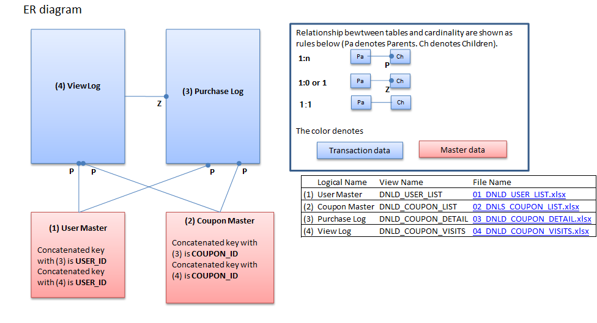

---
title: "Assigment 1"
author: "Andresa de Andrade"
date: "October 4, 2015"
output:
  pdf_document:
    fig_caption: yes
    keep_tex: yes
    number_sections: yes
    toc: yes
  html_document:
    bibliography: bibliography.bib
    fig_caption: yes
---

<ul><li>

#<a href="#toc_0">Abstract</a>
In recent years, it's become important to understand the factors that lead a buyer to finalize a conversion within the online marketing business. Thefore the purpose of this project is to understand any possible pattern in the customer behavior of an online shop and try to predict the types of coupons that the customers would want to use/buy. 

Along our way we shall demostrante the structure of categorization and how a machine learning algorithm would work for this particular case. We will also present the conditions assumed in order to have the model working properly. And the facts ignored but also important to a througoly analysis. 

We will also show the evaluation methods between the different methodologies here presented.

<ul> <li>
# <a href="#toc_0">Introduction</a>
In this paper and the follow documents presented along the way of this project, we will attempt to demonstrate if the online browsing history is correlated to final purchase. 

In that case, we will be using four data files to learn from. The first file is composed with the list of 22.874 customers and some personal information that will be described in the dataset section. The second file to be used is a file that contains information related to users buying voucher. And the third file to be used contain the data related to users browsing in the site. The last file to be used is the coupon detail information that contains all the data specifically about the coupon.

</li></ul>
<ul><li>

# <a href="#toc_0">Related Research</a>

There are several researches and projects done related to online customer behavior and coupon usage. 
 
 - Blattberg et al. (1978) suggested that the coupon usage would be related to demographics characteristics where the consumers are assumed to minimize the sum of transaction costs, storage  costs and the price of the item. He basically suggested that the upper income households, the more likely to redeem the coupon.
 
 - Narasimhan (1984) proposed that intensity of coupon usage is related inversely to a household's opportunity cost of time. Therefore it would be expected that in households that are more educated, have children under six and husband and wife are employed would have a lower prone to use coupons.
 
- Bawa and W. Shoemaker (1987) suggested that the intention of using the coupon (which in their project is called CPI - coupon proneness index) is a function of household characteristics and customer behavior.

-Kwon Jung (2010) suggested that the online usage of coupon is a funcion of the percentage of discount offered and demographics.

</li></ul>
<ul><li>
# <a href="#toc_0">Dataset</a>

As mentioned before, the dataset used is composed by 4 files and they all have an entity in common. Above you can see the ER diagram for the data.

 - user_list.csv: contains 6 features and 22,873 users. The features are related to (registered day, gender, age, date that unregistered, preferable name and user id).
 - coupon_detail.csv: contains 6 features and 168,997 entries. The columns consist in information about quantity bought, purchase date, geographic area that was bought, purchase identifier, user id and coupon id.
 - coupon_visits.csv: contains 8 features that refer manly to the browsing logs. The columns are purchase flag, purchase id in case it happened, log date, page serial, refer, coupon id, user id, session id.
 - coupon_list.csv contaisn 24 features related to the coupon like category, expire date, what week days it's available, discount value, and so on.
 
 

</li></ul>
<ul><li>

# <a href="#toc_1">Analysis</a>

In our process to model the data we will have 4 main steps.

- Data preparation: where will merge/join the tables creating one single table to be used. In addition we will check if there is any missing information or data that should be transformed. 
- Descriptive Analysis: where we will calculate basic statistics to understand how the data is distribuited.
- Modeling: where the methodology will be tested in order to predic the coupon usage. 
 -  Data Evaluation: the models will be compared and testes against each other in order to choose the best one.

## <a href="#toc_1">Data Preparation</a>

1 - The first step is to merge/ join the browsing history with the user clients to understand what each client did.

2  - The second is to merge/join the table obtained from 1 to the coupon details in order to get more clarification of what the coupon offered.

In this way we will have a flatened table with user, browsing, purchase and coupon information totalizing 44 features.

Because the data comes from Kaggle website, the competion does not share the purchase log for the test file. Therefore to evaluate the model we need to separate the dataset in 2 parts: train and test.  

Due the reasobable amount of data, we will separated the flatened table in 80% for the training and 20% for the testing and model evaluation. 

##Methodology

Looking back at the goal of this project, we need to predict online coupon usage based on customer behavior.

1 - We will do a descriptive analysis to understand how the data is distrbuited and if there's any outlier/ pattern that we should be aware of prior to the 

2 - One of the methoodologies very used in the related research is logistic regression. Basically the response variable would be a dummy variable considering 1 if the customer used the coupon and 0 otherwise. The explanatory data would be the customer pattern/behavior.

3 - We will also try to apply Knn methodology to see if there's any pattern that would helps us to predict the groups of buyers better. 

4 - Because the data has a lot of features, it would be interesting to understand if they are all necessary for the final model. In this case the methodology PCA will be applied until we reach a 80% of the variance explained. Once we have this short data, we will apply n. 2 and 3 and compare the results.

But before any sofisticated methodology, we have to use some descriptive and sensorial analyses do understand how the data is distributited and if the hypothesis for the methodology would be respected when we move to the model.

##Model Evaluation
We will present several models of visualization of the results, being the confusion of matrix the final evaluation of all the models.

Before and after PCA we will use their main model evaluation to measure if there's any difference. Being these last ones the pseudo R2, ROC curve for the logistic regression. And Accuracy being then main criteria for Knn.

#References

 - Online vs. Offline Coupon Redepmtion Behaviors Kwon Jung 2010

 - The Coupon Prone Consumer: Some Findings Based on Purchase Behavior accross Product Classes.

 - Evaluating Logistic Regression at http://www.r-bloggers.com/evaluating-logistic-regression-models/
  
 - Tools for Maching learning at http://aimotion.blogspot.ca/2010/08/tools-for-machine-learning-performance.html

</li></ul>

