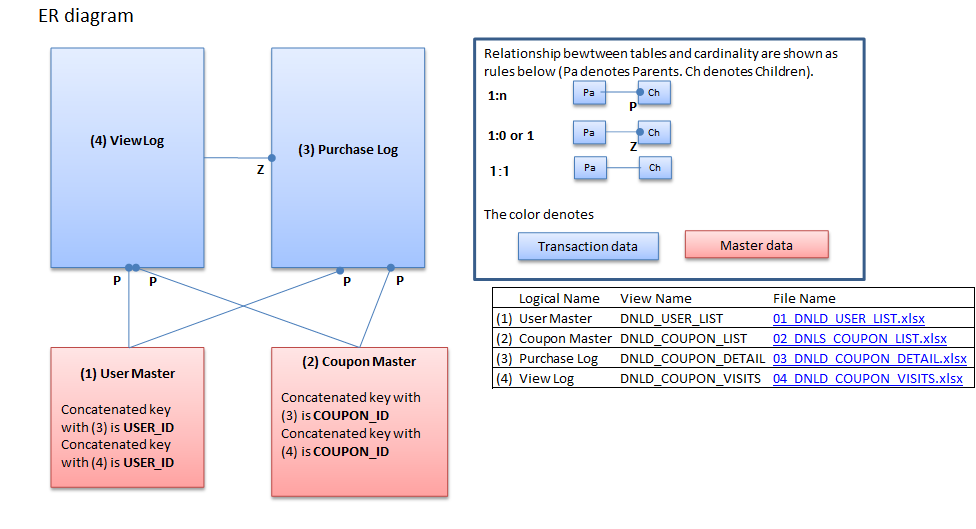

---
title: "Assignment 1"
author: "Andresa de Andrade"
date: "October 4, 2015"
output:
  pdf_document:
    fig_caption: yes
    keep_tex: yes
    number_sections: yes
    toc: yes
  html_document:
    bibliography: bibliography.bib
    fig_caption: yes
---

<ul><li>

#<a href="#toc_0">Abstract</a>
In recent years, it's become important to understand the factors that lead a buyer to finalize a conversion within the online marketing business. Therefore the purpose of this project is to understand any possible pattern in the customer behavior of an online shop and try to predict the types of coupons that the customers would want to use/buy. 

Along our way we shall demonstrate the structure of categorization and how a machine learning algorithm would work for this particular case. We will also present the conditions assumed in order to have the model working properly. And the facts ignored but also important to a thoroughly analysis. 

We will also show the evaluation methods between the different methodologies here presented.

<ul> <li>
# <a href="#toc_0">Introduction</a>
In this paper and the follow documents presented along the way of this project, we will attempt to demonstrate if the online browsing history is correlated to final purchase. 

In that case, we will be using four data files to learn from. The first file is composed with the list of 22.874 customers and some personal information that will be described in the dataset section. The second file to be used is a file that contains information related to users buying voucher. And the third file to be used contain the data related to users browsing in the site. The last file to be used is the coupon detail information that contains all the data specifically about the coupon.

</li></ul>
<ul><li>

# <a href="#toc_0">Related Research</a>

There are several researches and projects done related to online customer behavior and coupon usage. 
 
 - Blattberg et al. (1978) suggested that the coupon usage would be related to demographics characteristics where the consumers are assumed to minimize the sum of transaction costs, storage  costs and the price of the item. He basically suggested that the upper income households, the more likely to redeem the coupon.
 
 - Narasimhan (1984) proposed that intensity of coupon usage is related inversely to a household's opportunity cost of time. Therefore it would be expected that in households that are more educated, have children under six and husband and wife are employed would have a lower prone to use coupons.
 
- Bawa and W. Shoemaker (1987) suggested that the intention of using the coupon (which in their project is called CPI - coupon proneness index) is a function of household characteristics and customer behavior.

-Kwon Jung (2010) suggested that the online usage of coupon is a funcion of the percentage of discount offered and demographics.

</li></ul>
<ul><li>
# <a href="#toc_0">Dataset</a>

As mentioned before, the dataset used is composed by 4 files and they all have an entity in common. Above you can see the ER diagram for the data.

 - user_list.csv: contains 6 features and 22,873 users. The features are related to (registered day, gender, age, date that unregistered, preferable name and user id).
 - coupon_detail.csv: contains 6 features and 168,997 entries. The columns consist in information about quantity bought, purchase date, geographic area that was bought, purchase identifier, user id and coupon id.
 - coupon_visits.csv: contains 8 features that refer manly to the browsing logs. The columns are purchase flag, purchase id in case it happened, log date, page serial, refer, coupon id, user id, session id.
 - coupon_list.csv contains 24 features related to the coupon like category, expire date, what week days it's available, discount value, and so on.
 
 

</li></ul>
<ul><li>

# <a href="#toc_1">Analysis</a>

In our process to model the data we will have 4 main steps.

- Data preparation: where will merge/join the tables creating one single table to be used. In addition we will check if there is any missing information or data that should be transformed. 
- Descriptive Analysis: where we will calculate basic statistics to understand how the data is distributed.
- Modeling: where the methodology will be tested in order to predict the coupon usage. 
 -  Data Evaluation: the models will be compared and testes against each other in order to choose the best one.

## <a href="#toc_1">Data Preparation</a>

In order to run our model we will tread the dataset to have one flat table containing only users that had at least one interaction in the website and with the following features: 

1) purchaseflag: 1 or 0 variable containing 1 if purchase was made and 0 otherwise

2) age

3) price_rate: where it holds the percentage of discount that the customer can have

4) unique_referrer: how many referrers that user had before purchased something.

5) sessions: number of sessions prior to a purchase.

6) usable_date: days of the week that the coupon visited was available to be used.

7) city that the coupon was available to be used

8) business the coupon was available to be used.

As result we had a flat table with 2 million of interactions and therefore I selected 30 thousand interactions for this work.

Due the reasonable amount of data, we will separated the flattened table in 80% for the training and 20% for the testing and model evaluation. 

And the train data will be used with a cross validation approach.

##Methodology

Looking back at the goal of this project, it consisted in predict online coupon usage based on customer behavior.

1 - The data was transformed into portions that can be workable using our model (Logistic Regression)

2 - The data was spitted in 2, the train (80% or 24k interactions) and the test (20% or 6k interactions)

3 - The train data was spitted in 10 folds and the model was designed to each one of the folder and tested in the complimentary data.

4 - To select the best fitted model we used AUC or RoC as a criteria

5 - The model was then applied to the test dataset.

You can find the code to transform the data in this link:

"library("RWeka") # for datasets
library("ROCR") # visualize performance of classifiers
library("caret") # for confusion matrix
library("e1071") # may be needed for caret

sample_1<-read.csv('no_referrers.csv')

sample_1$price_rate<-as.numeric(sample_1$price_rate)
sample_1$age<-as.numeric(sample_1$age)
sample_1$item_count<-as.numeric(sample_1$item_count)
sample_1[,6]<-as.numeric(sample_1[,6])

features = paste(names(sample_1[2:length(names(sample_1))-1]),collapse = "+") 
formula_text <- paste(names(sample_1[1]),"~", features)
formula <- as.formula(formula_text)

rn_train <- sample(nrow(sample_1), 
                   floor(nrow(sample_1)*0.8))
folds <- createFolds(sample_1$purchase_flag)

i = 1
for (f in folds){
  train <- sample_1[-f,] 
  cross_validation <- sample_1[f,]

  fit <- glm(formula,data=train,family=binomial())
  print(i)
  print(summary(fit))
  cross_validation$scores <- predict(fit, type="response", 
                      newdata=cross_validation)
  pred<-prediction(cross_validation$scores, cross_validation$purchase_flag)
  c <- confusionMatrix(as.integer(cross_validation$scores > 0.2), 
                     cross_validation$purchase_flag)
  c$table

  #writes chart
  perf<-performance(pred,"tpr","fpr")
  #plot_name = paste("output/RoC", i, ".png")
  #png(filename=plot_name)
  #plot_title = paste("cross_validation ", i)
  #plot(perf, lty=1, main = plot_title)

  # test$scores <- predict(fit, type="response", 
  #                     newdata=test)

  # pred<-prediction(test$scores, test$purchase_flag)
  # perf_test<-performance(pred,"tpr","fpr")
  # plot_name = paste("output/test_RoC", f, ".png")
  # png(filename=plot_name)  
  # plot(perf_test, lty=1, main = "Test Validation")
  i = i + 1

  }"

##Model Evaluation
The model evaluation consists in RoC and AuC as a good evaluation for logistic regression.

#References

 - Online vs. Offline Coupon Redemption Behaviors Kwon Jung 2010

 - The Coupon Prone Consumer: Some Findings Based on Purchase Behavior across Product Classes.

 - Evaluating Logistic Regression at http://www.r-bloggers.com/evaluating-logistic-regression-models/
  
 - Tools for Machine learning at http://aimotion.blogspot.ca/2010/08/tools-for-machine-learning-performance.html

</li></ul>

